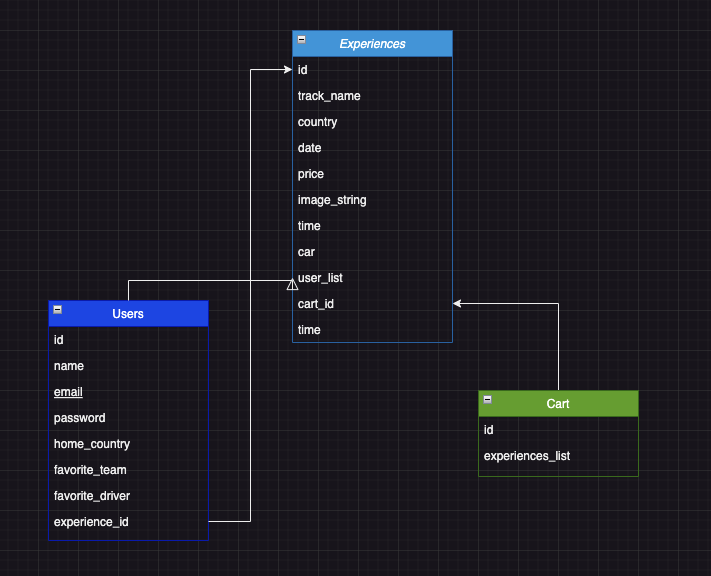

# Formula Zero (Back-End)

Link to front-end repo: https://github.com/EdgarJoell/formula-zero-front

## Description 
The purpose of this side of the application is to provide the front-end half of this app with the information and inner workings needed to power and populate the Formula Zero website with its respective information. 

<br>

## Tools and Technologies Used
- IntelliJ IDE
- -Languages 
  - Java
- Spring Boot
- Maven
- Postman
- Git & GitHub
- H2 database

<br>

## Testing
Completed with Cucumber and Rest Assured.

<br>

## Hurdles
Some hurdles that i had to overcome are what to do when it came to the Cart situation and how to update, and create the cart. I was able to overcome that problem with the help of my peers who were able to guide me and describe what the code was doing as well as help me understand how to move forward with the code. 

<br>

## User Stories
The user is the customer that would be purchasing the Experiences to Formula Zero.

Bronze: As a customer, I should be able to..
- See the individual experiences
- See the race schedule for the real Formula 1 races
- See the drivers for the upcoming races
- Add experiences to the cart
- pick a car when adding to the cart

Silver: As a customer I should be able to...
- Add experiences to the cart.
- Pick a car when adding to the cart
- Have a guest checkout
- Get an order ID
- Delete items from the cart

Gold: As a user I should be able to...
- Register an account
- Login to my existing account
- See previous experiences purchased
- Update user information
- Receive a confirmation email

<br>

## ERD Diagram



<br>

## Link to Project Board
https://github.com/users/EdgarJoell/projects/4/views/1

<br>

## Installation Instructions
Make sure to have IntelliJ downloaded before continuing. Then fork and clone this repository to your local machine. Once the file is on your local machine, open the folder in IntelliJ and make sure the file is set up to run JDK 17 and make sure to have this list of dependencies in the pom.xml file.
```xml
	<dependencies>
		<dependency>
			<groupId>org.springframework.boot</groupId>
			<artifactId>spring-boot-starter</artifactId>
		</dependency>
		<dependency>
			<groupId>org.springframework.boot</groupId>
			<artifactId>spring-boot-starter-jdbc</artifactId>
		</dependency>
		<dependency>
			<groupId>org.springframework.boot</groupId>
			<artifactId>spring-boot-starter-data-jpa</artifactId>
		</dependency>
		<dependency>
			<groupId>com.h2database</groupId>
			<artifactId>h2</artifactId>
			<scope>runtime</scope>
		</dependency>

		<dependency>
			<groupId>org.springframework.boot</groupId>
			<artifactId>spring-boot-starter-test</artifactId>
			<scope>test</scope>
		</dependency>
		<dependency>
			<groupId>org.springframework.boot</groupId>
			<artifactId>spring-boot-starter-web</artifactId>
		</dependency>
	</dependencies>
```

<br>

## Endpoints for API

| Request Type | URL                                    | Functionality                                                 | Access  | 
|--------------|----------------------------------------|---------------------------------------------------------------|---------|
| GET          | /api/experiences/                      | Gets all available experiences              	                 | Public  |
| GET          | /api/experiences/{experienceId}        | Gets one experience by id       	                             | Public  |
| PUT          | /api/update-experiences/{experienceId} | Gets an experience by id and updates its properties         	 | Public  |
| GET          | /api/cart/1/                           | Gets the cart and its contents         	                      | Public  |
| POST         | /api/cart/1/{experienceId}   	         | Adds experience to the cart         	                         | Public  |

<br>

## Special Thanks To:
My peers that helped me figure out where I was going wrong with my code.
Thank you to: 
- Maksym Zinchenko - GitHub profile: https://github.com/maklaut007
- Kevin Barrios - GitHub profile: https://github.com/dayjyun
- Jiajin (Jeff) Ou - GitHub profile: https://github.com/pophero110

<br>

## Resources
- Previous lessons from course
- Previous projects from course
- Stack Overflow
- Fellow students from course